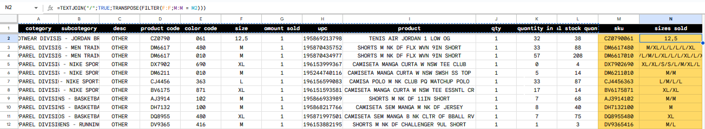
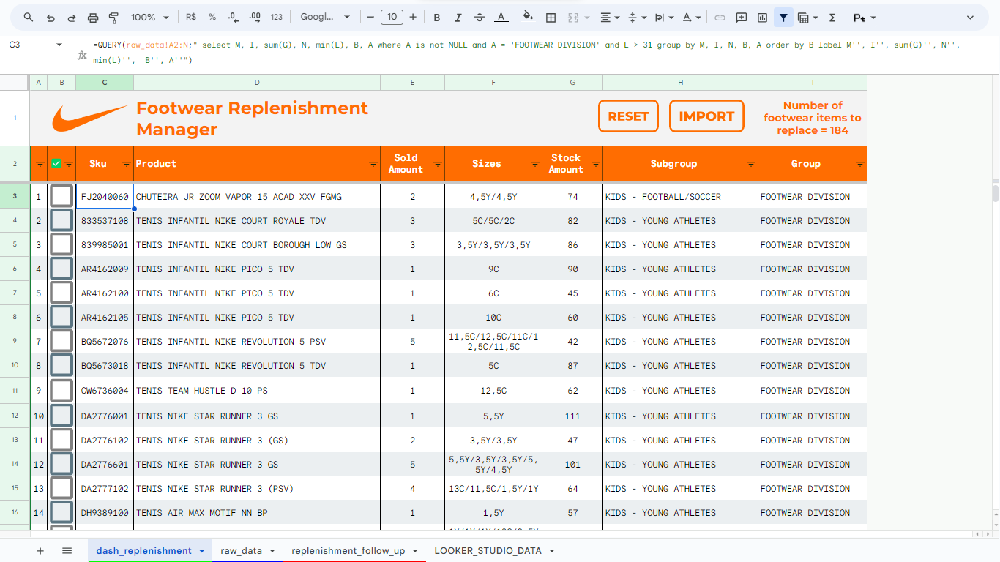
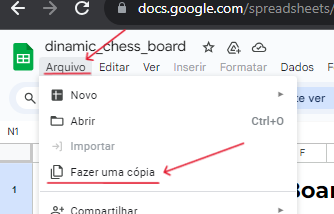

# 👟Gerenciador de Reposição de Calçados

Esse foi o meu primeiro trabalho com análise de dados, onde busquei aplicar alguns conhecimentos e utilizar algumas ferramentas que estava estudando no momento. Trata-se de um estudo sobre a reposição do piso de vendas de uma loja Nike na qual trabalhei por um tempo.

## ⚠️Introdução

Quem trabalha com o varejo sabe que passamos o ano inteiro se programando e preparando para os dois últimos meses do ano, mês de Black Friday e Natal. Mas esse período não é só feito dessas sazonalidades, algumas pessoas entram de férias, algumas recebem seu décimo terceiro, e isso tudo contribui para tornar essa época o período de maior vendas no ano.

Além disso, a loja em questão estava passando por um momento de alta nas vendas desde o início do ano, aumentando muito o giro dos produtos no piso de vendas, e inviabilizando a forma como a reposição estava sendo feita até então. Com isso em mente, propûs ao meu gerente realizar um estudo sobre tal processo e entendermos qual a melhor forma de otimizarmos para, mesmo com o constante aumento do giro de produtos, mantermos o piso de vendas sempre reposto.

## 🗺️Mapeamento dos processos existentes

Para entender como melhorar esse processo primeiro eu precisava entender como poderia mapear os dados que eram gerados, mesmo que de forma "analógica". Digo de forma analógica pois até então a reposição era feita manualmente por um colaborador que passava anotando os itens faltantes. Esse processo além de ser demorado era muito suscetível a erro humano, o que acabava atrasando ainda mais o processo.

Além disso, não tínhamos algumas informações básicas como:
- Quais os dias que mais precisam de reposição?
  - Sábado precisa mais que domingo ou é o inverso?
- Qual o tempo médio leva uma reposição?
- Quantas caixas precisam ser repostas por lista de reposição?

O primeiro passo foi automatizar a lista de reposição, e para isso, definimos horários específicos para realizar a reposição, sendo:
<br><br>
<div align="center"> <b>09:00 - 12:00 - 14:00 - 16:00 - 18:00 - 20:00</b> </div>
<br>

E para os saber quais foram os produtos vendidos nesses períodos, decidimos, em cada um desses intervalos de horário, puxar um relatório, já que o próprio ERP que a empresa usa fornece a opção de exportar esses dados em CSV. 

## 🛠️Estruturando o ETL

O relatório em questão, gerado pelo ERP, é estruturado da seguinte forma:
```
category,subcategory,desc,product code,color code,size,amount sold,upc,product,qty,size,quantity in stock,total stock,quantity
"FOOTWEAR DIVISION","MENS - JORDAN BRAND","OTHER","CZ0790","061","12,5","01","195869213798","TENIS AIR JORDAN 1 LOW OG",1,32,38
"APPAREL DIVISION","MENS - MEN TRAINING","OTHER","DM6617","480","M","01","195870435752","SHORTS M NK DF FLX WVN 9IN SHORT",1,33,88
"APPAREL DIVISION","MENS - MEN TRAINING","OTHER","DM6617","010","M","01","195870434977","SHORTS M NK DF FLX WVN 9IN SHORT",1,57,208
[...]
```
Nele temos itens não só da categoria `"FOOTWEAR"`, mas também `"APPAREL"` e `"EQUIPMENT"` além de algumas colunas que não são tão interessantes para nós, como `"upc"` e `"desc"`

Além disso, precisariamos de uma coluna com o SKU completo, que se forma concatenando a coluna `"product code"` com a `"color code"` e uma coluna especificando todos os tamanhos vendidos daquele SKU. Para conseguir isso criei uma função no Apps Script para importar o CSV e organizar esses dados em uma planilha
```
let ss = SpreadsheetApp.getActiveSpreadsheet()
let ui = SpreadsheetApp.getUi()
let rawDataSheet = ss.getSheetByName('raw_data')
let replenishmentSheet = ss.getSheetByName('dash_replenishment')
let fSource = DriveApp.getFolderById('xxxxxxx-xxxxxxxx-xxxxxx') // Change to the ID for the folder that will have your CSV
let fi = fSource.getFilesByName('data.txt') // Here, you can change the name of the file contaning the data in CSV format
let file = fi.next()

let csvData = Utilities.parseCsv(file.getBlob().getDataAsString())

function importCSV() {

  resetEverything(replenishmentSheet)

  rawDataSheet.getRange('A2:L').clearContent()
  rawDataSheet.getRange(2, 1, csvData.length, csvData[0].length).setValues(csvData)

  rawDataSheet.getRange('K:L').setNumberFormat('#,##0')
  rawDataSheet.getRange('D2:E').setNumberFormat('@')

  ui.alert('Sucesso!', 'Seu arquivo foi importado com sucesso', ui.ButtonSet.OK)
}
```

Com isso, criei uma coluna nova que seria fixa, para concatenar o SKU, e outra para organizar os tamanhos vendidos por SKU com a seguinte fórmula
```
=TEXTJOIN("/";TRUE;TRANSPOSE(FILTER(F:F;M:M = M2)))

// Onde
// F é a coluna "size"
// M é a coluna "sku"
```



Com isso, criei uma tela para receber esses dados e montar uma visualização organizada com os filtros necessários através da função QUERY
```
=QUERY(raw_data!A2:N;"
select M, I, sum(G), N, min(L), B, A
where A is not NULL and A = 'FOOTWEAR DIVISION' and L > 31
group by M, I, N, B, A
order by B
label M'', I'', sum(G)'', N'', min(L)'',  B'', A''")
```
Essa Query basicamente verifica:
- Se esse item é um calçado
- Se, no estoque consta mais que 31 itens, já que é a quantidade mínima para a exposição do produto
- Quais os tamanhos vendidos
- Qual a quantidade desse item ainda em estoque

<div align="center">
  
</div>


Análises:
- O primeiro passo foi tentar entender qual o comportamento das métricas obtidas durante os dias da semana
- Depois busquei entender se havia alguma relação entre a quantidade de caixas e a velocidade da reposição
- Também era interessante saber qual o período com a maior quantidade de caixas para a reposição

## 🛠️Experimente você mesmo
<div align="center">
  
[Clique aqui para acessar o projeto no Google Sheets](https://docs.google.com/spreadsheets/d/1mn2a6rvmRmbTJAmvRnIfbKGJGaze0Z7smsbyiP1VMl4/edit?usp=sharing)
<br>
[Clique aqui para acessar o Dashboard do projeto](https://lookerstudio.google.com/reporting/7ec11540-5f47-497a-9a0e-6b90426d62bc)
<br>
_(Para os scripts funcionarem corretamente, crie uma cópia na sua própria pasta do Google Drive)_
<br>
[Aprenda como dar permissões à sua conta para a execução dos scripts](https://github.com/gudaoliveira/apps_scripts_permissions)
<br><br>
 </div>

---

## 💻Como funciona?

- Simplesmente altere os valores nas células **"D2"** e **"H2"** para o número de linhas e colunas do tabuleiro, respectivamente, e clique no botão **"GERAR"**.
- Isso é tudo, agora espere a planilha imprimir o tabuleiro.
- Observe que o botão **GERAR** deve ter o script _[start.gs](https://github.com/gudaoliveira/dinamic_chess_board/blob/main/start.gs)_ atribuído para funcionar.

## 🧠Problemas Conhecidos
Este é uma ótima peça de portifólio para mim, mas poderia ser uma ótima peça para nós! Portanto, sinta-se à vontade para contribuir de qualquer maneira que você ache que melhoraria o projeto.

- Uma coisa que observei é que com valores grandes, a planilha pode ficar um pouco lenta, então, isso seria interessante a se melhorar.
- Além disso, talvez adicionar mais opções de formatação seria uma boa ideia.

Feito com 💞 no Brasil💚💛
